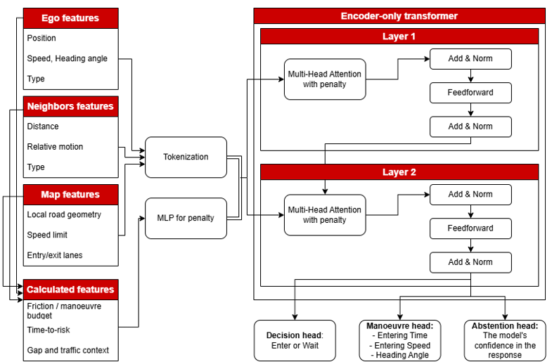

# Interaction-Aware Attention for Ego Motion Prediction
A lightweight Transformer attention modification that uses learned pairwise interaction features to improve ego vehicle motion prediction in roundabout scenes.

## Why this project?

In dense traffic scenes, not every surrounding agent is equally relevant to the future motion of the ego vehicle.

Standard self-attention learns relationships mainly from token features. However, two agents with similar motion states may have very different interaction relevance depending on their relative position, velocity, heading, or time-to-contact.

This project adds explicit pairwise interaction information directly to the attention scores while keeping the main Transformer architecture unchanged.

## Main idea

For each pair of agents, a small MLP processes interaction features such as:
- relative position
- relative velocity
- distance
- closing speed
- time-to-contact (TTC)
- relative heading

The MLP produces a learned signed attention bias. The bias can either increase or decrease the attention between two agents depending on whether that interaction is useful for predicting ego motion.

## How it works

The model uses an encoder-only Transformer to processes all tokens at once with:
* one ego vehicle token
* surrounding-agent token

The standard attention score is $S_{ij} = \frac{Q_i K_j^T}{\sqrt{d}}$  
We modify it as **S'ij = Sij - λ Bij** where:

* $B_{ij}$ is a learned interaction-aware bias for token pair $(i,j)$
* $\lambda$ controls the strength of the bias

 
    

 
    <i>The learned bias is bounded and can be either positive or negative, allowing the model to increase attention to useful interactions or suppress less relevant ones.</i>

## Outputs

The encoded ego token is used to predict the ego vehicle state at a fixed future horizon:
- future relative position: $\Delta x, \Delta y$
- future speed
- future heading represented as sine and cosine

## Why interaction-aware attention?

The method does not use hand-written rules to decide which vehicles should receive more attention.

Instead, the model receives additional information about the relationship between each pair of agents and learns from the motion-prediction objective how this interaction should affect attention.

_This keeps the Transformer structure lightweight while adding an explicit interaction-aware inductive bias._

## Results

The models were evaluated on the same recording-level test split using 10 RounD recordings.  
The high-interaction subset contains scenes with TTC < 3 s and at least 3 agents.

| Test set | Model | Position Error @1s ↓ | Speed MAE ↓ | Heading MAE ↓ |
|---|---|---:|---:|---:|
| Full test set | Vanilla Attention | 0.296 m | 0.300 m/s | **1.620°** |
| Full test set | Interaction-Aware Attention | **0.267 m** | **0.223 m/s** | 1.839° |
| High-interaction subset | Vanilla Attention | 0.318 m | 0.345 m/s | **1.855°** |
| High-interaction subset | Interaction-Aware Attention | **0.291 m** | **0.278 m/s** | 2.114° |

### Analysis

The interaction-aware model improves position and speed prediction on both the full test set and the high-interaction subset. This suggests that the learned attention bias helps the model use surrounding vehicles that are relevant to the ego vehicle's motion.

Heading accuracy becomes slightly worse. A likely reason is that heading depends more on the ego vehicle's own motion and local trajectory, while the interaction bias gives more weight to information from surrounding agents. Since position, speed, and heading are predicted from the same shared representation, improving one type of motion information can slightly hurt another.
